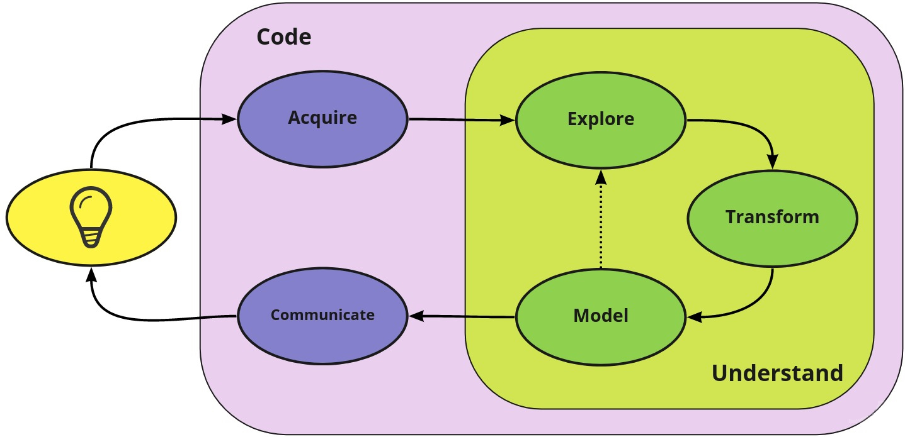

# Data Acquisition & Exploration

## Agenda
- [ ] Introduction to Pandas
    - [ ] Loading Data and Exploratory Data Analysis
- [ ] Visualising Single Variables
    - [ ] Aggregating and Summarising Information
    - [ ] Live Demo - Continuous & Discrete Variables
- [ ] Miscellaneous

## Notebook
- [:fontawesome-solid-file-code: Functions and Packages](https://colab.research.google.com/github/mickaeltemporao/itds/blob/main/materials/03-functions-and-packages.ipynb)
- [:fontawesome-solid-file-code: Introduction to Data Exploration](https://colab.research.google.com/github/mickaeltemporao/itds/blob/main/materials/04-functions-and-packages.ipynb)

## Misc
- Student Representative

## Types of data

We have seen that there are different types of data in R (numeric, character, factor, logical, ...). In the real world, we can group data in two broad families:

**Discrete** data can only take a finite number of values.

- eg. The number of students in a class.

**Continuous** data can take an infinite number of values.

- eg. The height of a student.

## For next time
- :fontawesome-solid-laptop-house: Recommended Practice
    - [:fontawesome-solid-file-code: Functions and Packages](https://colab.research.google.com/github/mickaeltemporao/itds/blob/main/materials/03-functions-and-packages.ipynb)
    - [:fontawesome-solid-file-code: Functions and Packages](https://colab.research.google.com/github/mickaeltemporao/itds/blob/main/materials/04-single-variable-.ipynb)
- :fontawesome-solid-chalkboard-teacher: Live Demo
    - [:fontawesome-regular-calendar-check: Book an appointment](https://calendly.com/mickaeltemporao/one-on-one) with the instructor.
    - Prepare a handout using the [:fontawesome-solid-file-code: template](https://colab.research.google.com/github/mickaeltemporao/ids-materials/blob/main/handout-template.ipynb) and share it before the class meeting!
    - Prepare a 10 minutes live demo.

