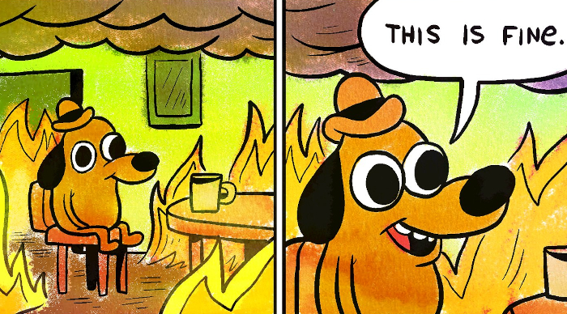

# Introduction

## Agenda
- [ ] Introductions
- [ ] The What, Why, How of Data Science
- [ ] The Syllabus
- [ ] Live Demo Planning
- [ ] GitHub & Gitter

## For next time

- Complete [Onboarding](../resources/onboarding.md) before the next class.
- Start thinking about factors that might influence voting behaviour.
    - You can take a look at the variable list in the [*"American National Election Study"*](https://sda.berkeley.edu/sdaweb/docs/nes2020full/DOC/hcbk.htm)
- Recommended readings:
    - [Grimmer, J. (2015). We are all social scientists now: How big data, machine learning, and causal inference work together. 'PS: Political Science & Politics', 48(1), 80-83.](https://stanford.edu/~jgrimmer/bd_2.pdf)
    - [Munafò, M. R., Nosek, B. A., Bishop, D. V., Button, K. S., Chambers, C. D., Du Sert, N. P., ... & Ioannidis, J. P. (2017). A manifesto for reproducible science. *Nature human behaviour*, 1(1), 1-9.](https://www.nature.com/articles/s41562-016-0021)
    - [Nosek, B. A., Ebersole, C. R., DeHaven, A. C., & Mellor, D. T. (2018). The preregistration revolution. *Proceedings of the National Academy of Sciences*, 115(11), 2600-2606.](https://www.pnas.org/content/115/11/2600.full)

